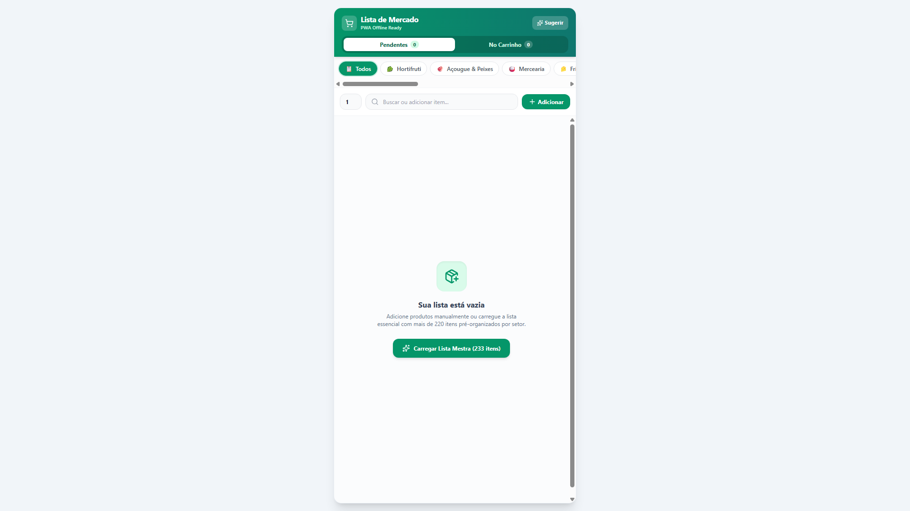

# Lista de Mercado

Aplicação web progressiva (PWA) para criação, organização e acompanhamento de compras no supermercado. O projeto organiza os itens pelos corredores e setores da loja, calcula o progresso em tempo real, auto-categoriza produtos ao digitar, permite compras 100% offline e exporta a lista agrupada por setor diretamente para o WhatsApp.

## Status do projeto

**Concluído com versão em produção e PWA instalável.**

As funcionalidades de gestão da lista, auto-categorização inteligente, cálculo de progresso e instalação como Progressive Web App estão 100% implementadas e disponíveis.

## Objetivo do projeto

O Lista de Mercado foi desenvolvido para solucionar a dor real de quem faz compras físicas: itens desorganizados na tela, idas e vindas desnecessárias nos corredores do supermercado e falta de clareza sobre o que já foi colocado no carrinho.

Com uma interface mobile-first e lógica focada no dia a dia, a aplicação ordena automaticamente os produtos na sequência natural dos corredores e permite instalação nativa no celular.

## Demonstração

- **Aplicação em produção:** [https://lista-mercado-sage.vercel.app/](https://lista-mercado-sage.vercel.app/)
- **Repositório:** [https://github.com/tharciosantos/lista-mercado](https://github.com/tharciosantos/lista-mercado)



## Funcionalidades implementadas

### Organização da lista e auto-categorização

- **Lista Mestra com 220 itens pré-cadastrados** cobrindo todas as necessidades essenciais de supermercado.
- **Auto-categorização inteligente:** ao digitar qualquer produto (ex: *"maçã"*, *"frango"*, *"amaciante"*, *"ração"*), o sistema identifica e atribui o setor correto automaticamente.
- **11 Setores de Supermercado com identificação visual:**
  - 🥬 Hortifruti (35 itens)
  - 🥩 Açougue & Peixes (24 itens)
  - 🍚 Mercearia & Despensa (44 itens)
  - 🧀 Frios & Laticínios (18 itens)
  - 🍞 Padaria & Matinais (16 itens)
  - ❄️ Congelados (14 itens)
  - 🧴 Higiene Pessoal (24 itens)
  - 🧹 Limpeza & Casa (22 itens)
  - 🥤 Bebidas (14 itens)
  - 🐾 Pet Shop (8 itens)
  - 💡 Bazar & Utilidades (9 itens)
- **Ordenação lógica por corredores:** na visão geral, os itens são apresentados na sequência física dos corredores de mercado.
- **Busca em tempo real** nos itens pendentes ou no carrinho.

### Acompanhamento e controle de compras

- **Barra de progresso visual no topo:** exibe a porcentagem e a proporção de itens colocados no carrinho (ex: *14 de 20 itens · 70%*).
- **Contador de produtos e volumes totais** em tempo real.
- **Controle de quantidade** com botões de incremento e decremento inline.
- **Separação em abas:** *Pendentes* e *No Carrinho*.
- **Ação "Limpar Carrinho":** remove apenas os itens já coletados ao finalizar uma etapa, preservando os pendentes.
- **Ação "Nova Compra":** reinicialização da lista com confirmação.

### Persistência e integração WhatsApp

- **Persistência segura no `localStorage`** com sanitização e tratamento de exceções.
- **Compartilhamento estruturado para WhatsApp:** gera mensagem formatada em Markdown com cabeçalhos por setor e caixas de seleção (`◻️ 2x Arroz`).

### Progressive Web App (PWA Offline-First)

- Manifest configurado com tema esmeralda (`#059669`), modo standalone e suporte a tela cheia.
- Service Worker gerado com precaching de assets para uso 100% offline.
- Ícones em alta resolução para instalação nativa no Android, iOS e desktop.

## Tecnologias utilizadas

### Front-end

- React 19
- Vite 7
- Tailwind CSS 3
- Lucide React

### PWA e persistência

- vite-plugin-pwa (Service Worker & Manifest)
- Web Storage API (`localStorage`)

### Qualidade e deploy

- ESLint
- Vercel

## Estrutura geral do projeto

```text
lista-mercado/
├── public/
│   ├── pwa-192x192.png         # Ícone da PWA (192px)
│   ├── pwa-512x512.png         # Ícone da PWA (512px)
│   └── screenshot.PNG          # Imagem de demonstração
├── src/
│   ├── components/
│   │   ├── Controls.jsx        # Pílulas de categorias, busca e quantidade
│   │   ├── Header.jsx          # Progresso da compra, contadores e abas
│   │   └── ItemRow.jsx         # Card do item, checkbox, quantidade e exclusão
│   ├── App.jsx                 # Estado global, lista de 220 itens, auto-categorização e WhatsApp
│   ├── index.css               # Estilos globais
│   └── main.jsx                # Ponto de entrada da aplicação
├── package.json                # Dependências e scripts
├── tailwind.config.js          # Configuração do Tailwind CSS
└── vite.config.js              # Configuração do Vite e da PWA
```

## Como executar localmente

### 1. Clone o repositório

```bash
git clone https://github.com/tharciosantos/lista-mercado.git
cd lista-mercado
```

### 2. Instale as dependências

```bash
npm install
```

### 3. Inicie a aplicação

```bash
npm run dev
```

Acesse [http://localhost:5173](http://localhost:5173) no navegador.

### Scripts disponíveis

| Comando | Descrição |
| --- | --- |
| `npm run dev` | Inicia o servidor de desenvolvimento Vite. |
| `npm run build` | Gera o build de produção e o Service Worker da PWA. |
| `npm run lint` | Executa a verificação com ESLint. |
| `npm run preview` | Executa localmente o build de produção gerado. |

## Autor

**Nome:** Tharcio Santos  
**GitHub:** [https://github.com/tharciosantos](https://github.com/tharciosantos)  
**LinkedIn:** [https://www.linkedin.com/in/tharcio-santos-dev/](https://www.linkedin.com/in/tharcio-santos-dev/)  
**Portfólio:** [https://tharcio-portfolio.vercel.app/](https://tharcio-portfolio.vercel.app/)
